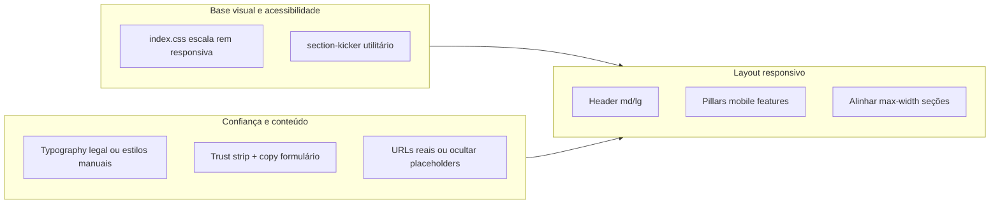

# Plano: responsividade, visual e credibilidade do site

## O que já existe (base sólida)

- **Stack**: React + Vite, Tailwind, Framer Motion, Lenis em [`MainLayout.tsx`](c:\Users\jg\Documents\KAIRUS\site_napse\src\components\layout\MainLayout.tsx), rotas para termos e privacidade em [`App.tsx`](c:\Users\jg\Documents\KAIRUS\site_napse\src\App.tsx).
- **Seções** (ordem na home): Hero → Pilares → Integrações (bento) → Showcase app → Suporte → Stats → Preços → Depoimentos → FAQ → Contato → CTA final; **IDs** batem com o [`Header.tsx`](c:\Users\jg\Documents\KAIRUS\site_napse\src\components\layout\Header.tsx) (`#ecossistema`, `#integracoes`, etc.).
- **Tom visual**: paleta `nat-*`, cards com blur/sombra, hero com vídeo; footer já traz “LGPD” e “SSL” com ícones em [`Footer.tsx`](c:\Users\jg\Documents\KAIRUS\site_napse\src\components\layout\Footer.tsx).

## Problemas encontrados (impacto direto)

| Área | Problema |
|------|----------|
| CSS global | Em [`index.css`](c:\Users\jg\Documents\KAIRUS\site_napse\src\index.css), `html { font-size: 80% }` reduz **toda** a escala Tailwind (rem). Em mobile isso piora legibilidade e acessibilidade — frágil para “credibilidade” e leitura confortável. |
| Integrações | Classe `section-kicker` em [`IntegrationsBentoGrid.tsx`](c:\Users\jg\Documents\KAIRUS\site_napse\src\components\sections\IntegrationsBentoGrid.tsx) **não está definida** em `index.css` nem no `tailwind.config` — o subtítulo da seção provavelmente não tem o estilo pretendido. |
| Páginas legais | [`PoliticaPrivacidade.tsx`](c:\Users\jg\Documents\KAIRUS\site_napse\src\pages\PoliticaPrivacidade.tsx) e [`TermosDeServico.tsx`](c:\Users\jg\Documents\KAIRUS\site_napse\src\pages\TermosDeServico.tsx) usam `prose prose-slate`, mas **não há** `@tailwindcss/typography` no [`package.json`](c:\Users\jg\Documents\KAIRUS\site_napse\package.json) — as classes `prose` não geram o layout tipográfico esperado; documentos legais ficam menos legíveis e menos “oficiais”. |
| Footer / contato | Links de redes genéricos (`https://instagram.com`, `https://linkedin.com`) e WhatsApp placeholder (`5511999999999`) em [`Footer.tsx`](c:\Users\jg\Documents\KAIRUS\site_napse\src\components\layout\Footer.tsx) e [`ContactSection.tsx`](c:\Users\jg\Documents\KAIRUS\site_napse\src\components\sections\ContactSection.tsx) — sinal fraco de confiança até troca por URLs reais ou remoção. |
| Formulário | Submit só muda estado local (`setSubmitted`) — ok para demo, mas para credibilidade convém texto curto + link para política e expectativa clara (ex.: “uso dos dados conforme política”). |
| Header desktop | Navegação com **muitos itens** + ícones de `sm:` em diante; em laptops médios pode **apertar ou quebrar** layout antes de `lg`. Vale testar em ~1024–1280px e ajustar (ex.: scroll horizontal discreto, labels abreviados em `md`, ou “Mais” com dropdown). |
| Pilares (mobile) | Em [`PillarsSection.tsx`](c:\Users\jg\Documents\KAIRUS\site_napse\src\components\sections\PillarsSection.tsx), grade `grid-cols-4` com `text-[10px]` nos pills de recurso — muito pequeno, especialmente com `font-size` global reduzido. |
| Ritmo de layout | Mistura de `max-w-7xl` (header) vs `max-w-[100rem]` (várias seções) e `gap-10` global em [`App.tsx`](c:\Users\jg\Documents\KAIRUS\site_napse\src\App.tsx) — não é bug, mas padronizar **largura máxima** e **padding horizontal** por breakpoint melhora percepção de produto “acabado”. |

## Direção de implementação (sem expandir escopo desnecessário)

### 1. Tipografia e escala global

- Em [`index.css`](c:\Users\jg\Documents\KAIRUS\site_napse\src\index.css): substituir `font-size: 80%` fixo por escala **responsiva** (ex.: `100%` em viewports estreitas; opcionalmente `93–100%` em `md+` e só então densidade maior em `xl+` se ainda desejarem o site “mais compacto”). Objetivo: **WCAG-friendly** em mobile sem mudar o design desktop de forma drástica.

### 2. Corrigir `section-kicker` e consistência de “kickers”

- Definir `.section-kicker` em `@layer components` no [`index.css`](c:\Users\jg\Documents\KAIRUS\site_napse\src\index.css) alinhado aos outros kickers (`text-sm font-semibold uppercase tracking-[0.2em]`, etc.) **ou** trocar a classe em [`IntegrationsBentoGrid.tsx`](c:\Users\jg\Documents\KAIRUS\site_napse\src\components\sections\IntegrationsBentoGrid.tsx) pelas mesmas utilitárias usadas em Pillars/Pricing.

### 3. Páginas legais legíveis

- **Opção A (recomendada)**: adicionar `@tailwindcss/typography`, registrar o plugin em [`tailwind.config.ts`](c:\Users\jg\Documents\KAIRUS\site_napse\tailwind.config.ts) e manter `prose` nas páginas legais.
- **Opção B**: remover `prose` e aplicar classes Tailwind explícitas em headings/parágrafos/listas (sem dependência extra).

### 4. Credibilidade: conteúdo e UI

- **Faixa de confiança** (nova seção leve ou bloco no fim do Hero / antes do footer): ícones curtos + texto factual (ex.: dados em trânsito cifrados, aderência LGPD, backups — apenas o que for **verdadeiro** para o produto).
- **Contato**: em [`ContactSection.tsx`](c:\Users\jg\Documents\KAIRUS\site_napse\src\components\sections\ContactSection.tsx), linha com link para [`/politica-de-privacidade`](c:\Users\jg\Documents\KAIRUS\site_napse\src\App.tsx) e menção ao uso dos dados; se o envio for só front-end, deixar explícito (“demonstração” / “em breve integração”) **ou** integrar serviço real (Formspree, API) — alinhar com o que a equipe puder comprometer.
- **Footer**: atualizar `socialLinks` e `supportItems` com URLs oficiais; se ainda não existirem, remover entradas genéricas em vez de apontar para domínios errados.

### 5. Responsividade pontual

- **Header**: após ajuste de escala global, testar `sm`–`lg`; se necessário, `overflow-x-auto` + `scrollbar-hide` na pílula de nav, ou menu “Mais” para itens secundários.
- **Pilares mobile**: trocar `grid-cols-4` por `grid-cols-2` em telas muito estreitas ou aumentar tamanho mínimo de fonte nos rótulos (evitar `10px`).
- **Integrações**: revisar `sm:grid-cols-3` com cards “featured” que ocupam 2 colunas — em alguns breakpoints a ordem visual pode ser refinada (opcional, baixa prioridade).

### 6. Opcional (qualidade de experiência)

- Scroll do header usa `window.scrollTo`; com Lenis, avaliar `useLenis` + `scrollTo` da instância Lenis para alinhar animação com o restante da página ([`useLenis.ts`](c:\Users\jg\Documents\KAIRUS\site_napse\src\hooks\useLenis.ts) já exporta o hook).

## Ordem sugerida de trabalho

1. `index.css` (escala rem + `section-kicker`).
2. Legal pages (typography ou estilos manuais).
3. Trust copy + footer/contact URLs reais.
4. Header + Pillars mobile após validar em DevTools (375px, 768px, 1024px, 1280px).
5. Polimento de `max-w-*` / paddings se ainda houver sensação de desalinhamento.

## Validação

- Inspecionar em mobile (375px), tablet (768px) e desktop (1280px+).
- Verificar contraste de textos sobre fundos coloridos (Pilares cards).
- Lighthouse (Accessibility) após mudar `font-size` global.
